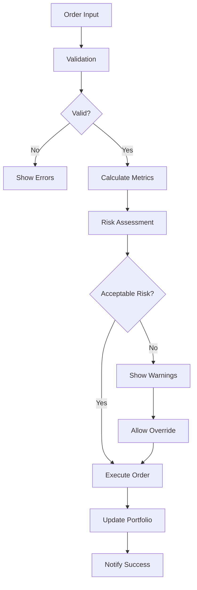

# TradingEngine Component

The **TradingEngine** is the most advanced component in the AI Trading Agent, providing comprehensive buy/sell functionality with professional-grade features including risk management, AI integration, and multiple order types.

## 🎯 Overview

The TradingEngine component is a sophisticated React component that provides:
- **Multi-modal Trading**: Manual, AI-assisted, and quick trading modes
- **Advanced Order Types**: Market, Limit, Stop-Loss, and Stop-Limit orders
- **Real-time Risk Management**: Position sizing, risk calculations, and warnings
- **AI Integration**: Seamless integration with AI trading signals
- **Professional Validation**: Comprehensive order validation and error handling

## 🚀 Features

### Core Trading Functionality
- **Buy/Sell Orders**: Full support for both long and short positions
- **Order Types**: Market, Limit, Stop-Loss, Stop-Limit with proper validation
- **Real-time Execution**: Immediate order processing with live feedback
- **Commission Calculation**: Automatic commission and fee calculations
- **Position Management**: Intelligent position sizing and risk management

### Advanced Risk Management
- **Automatic Position Sizing**: Based on portfolio risk percentage
- **Risk Calculations**: Real-time risk assessment per trade
- **Portfolio Limits**: Maximum position size enforcement
- **Stop-Loss Integration**: Automatic stop-loss price calculations
- **Validation System**: Comprehensive pre-trade validation

### AI-Powered Features
- **AI Signal Integration**: Direct integration with AI trading recommendations
- **Confidence Scoring**: Visual confidence indicators for AI signals
- **Automated Execution**: One-click AI signal execution
- **Educational Explanations**: Human-readable AI reasoning

### User Experience
- **Tabbed Interface**: Clean separation of trading modes
- **Real-time Feedback**: Instant order status updates
- **Visual Indicators**: Color-coded risk levels and status
- **Responsive Design**: Works perfectly on all screen sizes

## 📋 Props Interface

```typescript
interface TradingEngineProps {
  symbol: string;                    // Trading symbol (e.g., 'AAPL')
  marketData: MarketData | null;     // Real-time market data
  portfolio: Portfolio | null;       // Current portfolio state
  aiSignal?: AISignal;              // Optional AI trading signal
  onOrderExecuted: (order: Order) => void;     // Order execution callback
  onPortfolioUpdated: (portfolio: Portfolio) => void; // Portfolio update callback
  className?: string;                // Optional CSS classes
}
```

## 🛠️ Usage Examples

### Basic Implementation
```tsx
import TradingEngine from '@/components/trading/TradingEngine';

function TradingDashboard() {
  const [portfolio, setPortfolio] = useState<Portfolio | null>(null);
  const [marketData, setMarketData] = useState<MarketData | null>(null);
  
  const handleOrderExecuted = (order: Order) => {
    console.log('Order executed:', order);
    // Update portfolio, refresh data, etc.
  };
  
  const handlePortfolioUpdated = (updatedPortfolio: Portfolio) => {
    setPortfolio(updatedPortfolio);
  };
  
  return (
    <TradingEngine
      symbol="AAPL"
      marketData={marketData}
      portfolio={portfolio}
      onOrderExecuted={handleOrderExecuted}
      onPortfolioUpdated={handlePortfolioUpdated}
    />
  );
}
```

### With AI Integration
```tsx
function AITradingDashboard() {
  const [aiSignal, setAISignal] = useState<AISignal | null>(null);
  
  // Fetch AI signal
  useEffect(() => {
    const fetchAISignal = async () => {
      const response = await fetch(`/api/ai/signal?symbol=AAPL`);
      const signal = await response.json();
      setAISignal(signal);
    };
    
    fetchAISignal();
  }, []);
  
  return (
    <TradingEngine
      symbol="AAPL"
      marketData={marketData}
      portfolio={portfolio}
      aiSignal={aiSignal}  // AI signal integration
      onOrderExecuted={handleOrderExecuted}
      onPortfolioUpdated={handlePortfolioUpdated}
    />
  );
}
```

## 🎨 Trading Modes

### 1. Manual Trading
The default mode for experienced traders:
- **Order Side Selection**: Buy/Sell toggle buttons
- **Order Type Selection**: Market, Limit, Stop-Loss, Stop-Limit
- **Quantity Input**: Manual quantity entry with recommendations
- **Price Inputs**: Limit price and stop price fields
- **Advanced Settings**: Time-in-force, risk management parameters

### 2. AI-Assisted Trading
Intelligent trading with AI recommendations:
- **AI Signal Display**: Shows AI recommendation with confidence
- **Risk Assessment**: AI-calculated risk levels
- **Target Prices**: AI-suggested target and stop-loss prices
- **One-Click Execution**: Execute AI recommendations instantly
- **Educational Reasoning**: Detailed explanation of AI decisions

### 3. Quick Trading
Rapid execution for active traders:
- **Percentage Buttons**: Buy/Sell 25%, 50%, or 100% of available funds
- **Instant Execution**: Immediate market order execution
- **Position-Based Selling**: Quick liquidation of existing positions

## 🔧 Order Types

### Market Orders
- **Immediate Execution**: Executes at current market price
- **Slippage Simulation**: Realistic price slippage modeling
- **Best for**: Quick entries and exits

### Limit Orders
- **Price Control**: Execute only at specified price or better
- **Price Validation**: Warns about prices far from market
- **Best for**: Precise entry/exit points

### Stop-Loss Orders
- **Risk Management**: Automatic loss limitation
- **Trigger Price**: Executes when stop price is reached
- **Best for**: Protecting existing positions

### Stop-Limit Orders
- **Combined Features**: Stop trigger with limit execution
- **Advanced Control**: Maximum execution price control
- **Best for**: Advanced risk management

## 📊 Risk Management Features

### Position Sizing
```typescript
interface PositionSizing {
  riskPercent: number;        // Percentage of portfolio at risk (default: 2%)
  useAIRecommendation: boolean; // Use AI for position sizing
  maxPositionPercent: number;   // Maximum position size (default: 10%)
}
```

### Risk Calculations
- **Risk per Share**: Calculated based on stop-loss distance
- **Total Risk**: Portfolio percentage at risk
- **Position Limits**: Automatic enforcement of position size limits
- **Buying Power**: Real-time available funds calculation

### Validation System
- **Pre-Trade Checks**: Comprehensive validation before execution
- **Error Prevention**: Clear error messages for invalid orders
- **Warning System**: Risk warnings for high-risk trades
- **Balance Verification**: Sufficient funds and position checks

## 🎯 Order Execution Flow



## 🔍 Advanced Features

### Real-time Order Metrics
The component automatically calculates and displays:
- **Estimated Execution Price**: Based on order type and market conditions
- **Total Order Value**: Including quantity and price
- **Commission Costs**: Realistic commission calculations
- **Total Cost**: All-in cost including fees
- **Risk Metrics**: Position risk and portfolio impact

### Smart Recommendations
- **AI-Based Sizing**: Automatic position sizing based on AI analysis
- **Risk-Adjusted Quantities**: Optimal quantity recommendations
- **Stop-Loss Suggestions**: Intelligent stop-loss price recommendations

### Professional Validation
- **Financial Validation**: Buying power and position availability
- **Price Validation**: Market price deviation warnings
- **Risk Validation**: Portfolio risk limit enforcement
- **Order Logic**: Proper order type parameter validation

## 🎨 Styling and Theming

The component uses a dark theme optimized for trading:
- **Color Coding**: Green for buy, red for sell, blue for neutral
- **Status Indicators**: Visual feedback for order status
- **Risk Colors**: Color-coded risk levels (green/yellow/red)
- **Responsive Design**: Adapts to different screen sizes

## 🔧 Customization Options

### Risk Management Parameters
```typescript
// Customize risk management settings
const customRiskSettings = {
  riskPercent: 3,           // 3% portfolio risk
  maxPositionPercent: 15,   // 15% maximum position size
  useAIRecommendation: true // Enable AI recommendations
};
```

### Commission Structure
```typescript
// Customize commission calculations
const COMMISSION_RATE = 0.001;  // 0.1% commission
const MIN_COMMISSION = 1.0;     // Minimum $1 commission
```

### Order Types
The component supports all major order types with proper validation and execution logic.

## 🚨 Error Handling

### Common Errors
- **Insufficient Funds**: Clear messaging about required vs. available funds
- **Invalid Quantities**: Validation for positive quantities
- **Missing Prices**: Required price validation for limit orders
- **Position Unavailability**: Check for sufficient shares to sell

### Warning System
- **High Risk Trades**: Warnings for trades exceeding risk thresholds
- **Large Positions**: Alerts for positions exceeding size limits
- **Price Deviations**: Warnings for limit prices far from market

## 📱 Mobile Responsiveness

The TradingEngine is fully responsive and provides an excellent mobile experience:
- **Touch-Friendly**: Large buttons and touch targets
- **Compact Layout**: Efficient use of screen space
- **Readable Text**: Appropriate font sizes for mobile
- **Gesture Support**: Swipe navigation between tabs

## 🔗 Integration Points

### API Endpoints
The component integrates with these API endpoints:
- `POST /api/trading/order` - Execute orders
- `GET /api/market-data/quote` - Get market data
- `GET /api/ai/signal` - Get AI recommendations

### State Management
- **Portfolio State**: Real-time portfolio updates
- **Market Data**: Live market data integration
- **Order History**: Automatic order tracking
- **AI Signals**: Dynamic AI recommendation updates

## 🎓 Educational Features

### Tooltips and Explanations
- **Order Type Explanations**: Hover tooltips for order types
- **Risk Education**: Clear risk metric explanations
- **AI Reasoning**: Detailed AI decision explanations

### Learning Integration
- **Progressive Disclosure**: Advanced features hidden until needed
- **Visual Feedback**: Clear status and progress indicators
- **Error Education**: Helpful error messages with solutions

## 🚀 Performance Optimizations

- **React.memo**: Optimized re-rendering
- **useMemo**: Expensive calculations cached
- **useCallback**: Event handler optimization
- **Debounced Inputs**: Smooth user input handling

## 🔒 Security Considerations

- **Input Validation**: All inputs properly validated
- **Order Limits**: Built-in position and risk limits
- **Demo Mode**: Safe simulation environment
- **Error Boundaries**: Graceful error handling

## 📈 Future Enhancements

### Planned Features
- **Options Trading**: Support for options contracts
- **Crypto Trading**: Cryptocurrency support
- **Advanced Charts**: Integrated chart analysis
- **Social Features**: Copy trading and strategy sharing
- **Backtesting**: Historical strategy testing

### API Integrations
- **Recall Competition**: Trading competition integration
- **Real Brokers**: Live broker API connections
- **News Integration**: Real-time news impact analysis

---

The TradingEngine component represents the pinnacle of trading interface design, combining professional functionality with educational value and AI-powered insights. It's designed to grow with users from beginner to expert level while maintaining safety and educational focus.